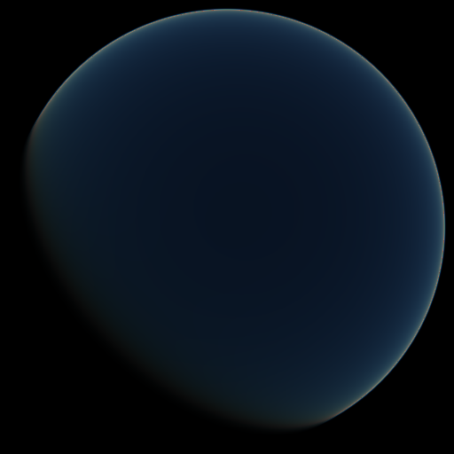

This is a minimalistic renderer of the single scattering in the atmosphere of the Earth as described in http://nishitalab.org/user/nis/cdrom/sig93_nis.pdf:
```
Nishita, Tomoyuki / Sirai, Takao / Tadamura, Katsumi / Nakamae, Eihachiro
Display of the Earth Taking into Account Atmospheric Scattering
1993
SIGGRAPH
```



# Usage
There is currently no command line parameter, simply enter the repository and run `make`; it will compile and render a $512 \times 512$ image (in `.ppm` format) of the Earth atmosphere.
The Earth is centered in the image, its surface is considered totally black; sun light is considered directional and is coming from the upper right corner, a bit behind the Earth.

# Dependencies
`make` and `g++` with C++17 and OpenMP support for compilation, and a PPM capable image viewer.
All this should be directly available in an Ubuntu distribution.
